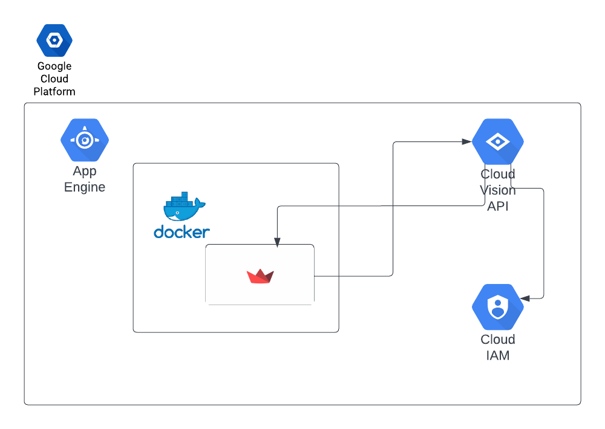
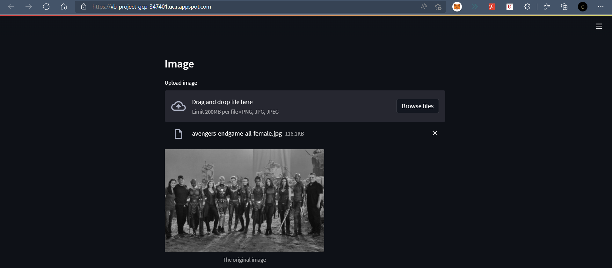
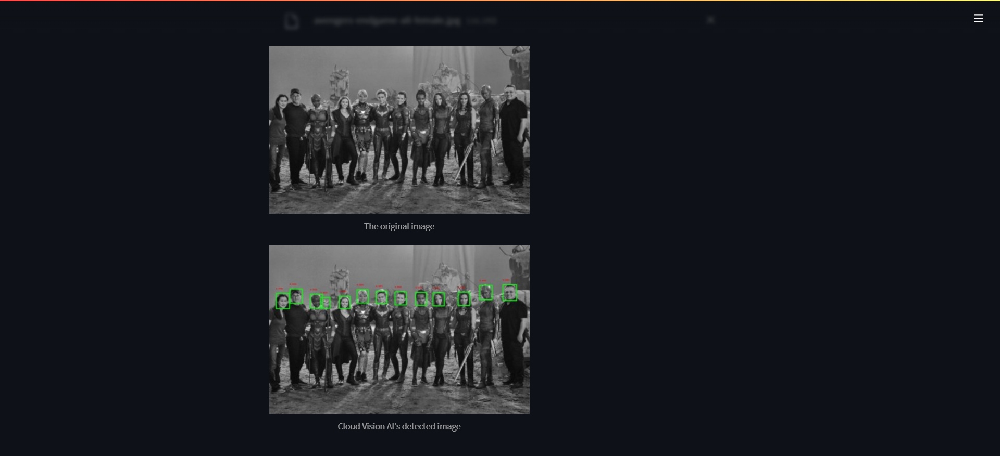

# face-detection-web-application

This repository houses the code for the face detection web application developed using **_Streamlit_** and **_Cloud Vision API_**. Deployment was done on GCP _**App Engine**_ using _**Docker**_.

# Tech Stack
<ul>
  <li> GCP App Engine </li>
  <li> GCP Cloud Vision API </li>
  <li> IAM & Admin </li>
  <li> Docker </li>
  <li> Streamlit </li>
</ul>

This project💻 was deployed🚀 on **Google Cloud Platform** and is accessible at <a href="https://vb-project-gcp-347401.uc.r.appspot.com/">GCP project</a>

# Block diagram

# Sample output

